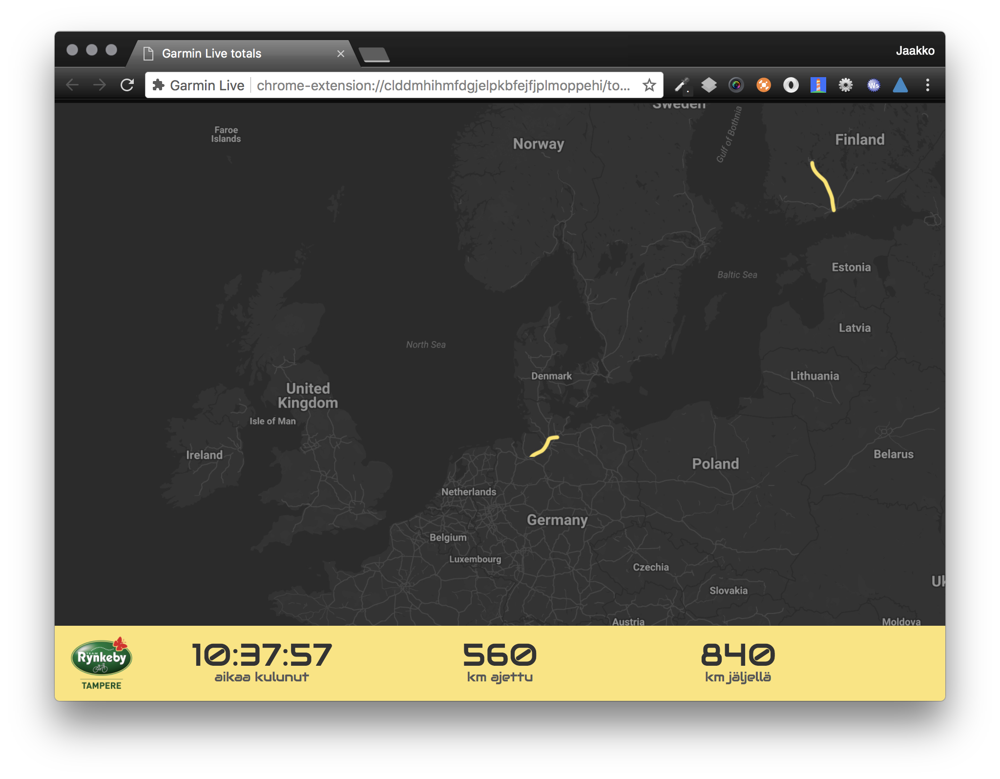

# Garmin Live extension

This is a very bespoke Chrome extension which captures distance information from Garmin Live tracking from multiple tabs and displays the total sum distance in results screen.

The extension is made for Team Rynkeby Tampere for their indoor cycling promotion in February 2018. The idea was to use four indoor trainers in shopping mall to cycle the same distance they did last year's Team Rynkeby (roughly 1400 km in total).

Each bike has Garmin cycling computer on it. Activity is live tracked on Garmin Connect and this extension collects distances and displays total travelled distance.

NOTE: This extension is not made to use in everyday life. Better to keep it disabled / uninstalled when not in the event :) Extension is not available on Google Web Store.

## How to use

* Download this package to your local computer: https://github.com/jaamo/garmin-live-extension/archive/master.zip
* Extract the folder to any location on your computer
* Open *Google Chrome*
* Open *Extensions* settings
* Enable *Developer mode*
* Click *Load unpacked extension*
* Navigate to the folder where you just unpacked the extension
* Click *Open*
* Extension should now be installed! You should be able to see blue Garmin triangle on your address bar
* Open Garmin live tracking pages. The extension should start capturing distances automatically
* Click the extension icon on the address bar to open totals page

## Troubleshooting

* If you open Garmin on Strava live page you should black box on the bottom right of the screen. That's the captured distance.
* Press `esc` to reset kilometers anytime.
* Press number keys from 0-9 to debug distance.

## Author

* Jaakko "Kampiapina" Alajoki
